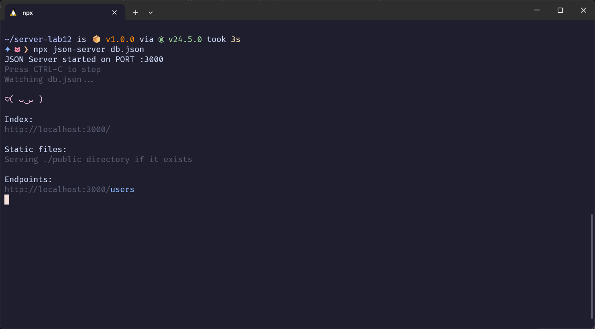
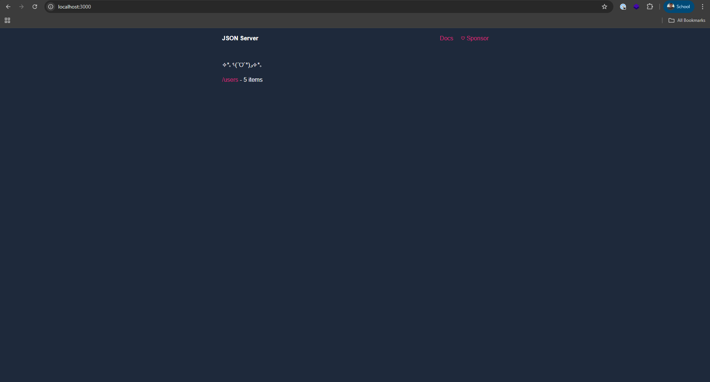
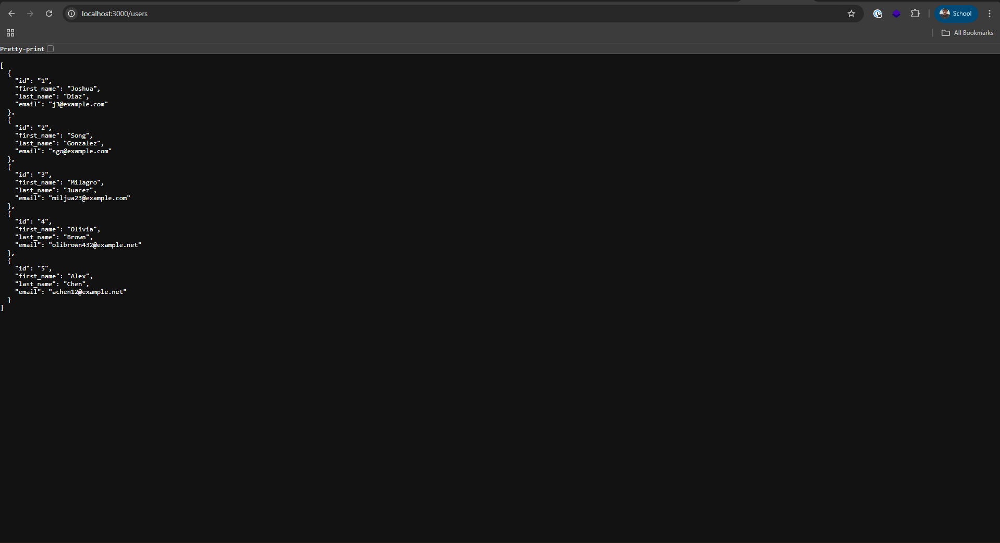

# Introducción al Laboratorio  

En este laboratorio trabajaremos con **json-server**, una herramienta que nos permite simular una API REST de manera sencilla a partir de un archivo JSON. Gracias a esto, podremos realizar operaciones típicas de un servidor (consultar, crear, actualizar y eliminar información) sin necesidad de implementar un backend real.  

El objetivo principal es que practiquen cómo interactuar con un servidor usando **fetch**, la API nativa de JavaScript para realizar peticiones HTTP. A través de distintas tareas aprenderán a:  

- Hacer solicitudes **GET** para obtener información.  
- Usar **POST** para crear nuevos registros.  
- Aplicar **PUT/PATCH** para actualizar datos existentes.  
- Implementar **DELETE** para eliminar recursos.  

Este laboratorio busca reforzar la comprensión de cómo funciona la comunicación cliente-servidor, así como la manipulación de datos en formato **JSON**, que es el estándar más común en aplicaciones web modernas.  

## Requisitos previos

Editor de código (ej. VS Code).

Node.js instalado (para ejecutar programas en la terminal).

## Preparación

Clonar el respositorio
```bash
git clone sshurl
```
Moverse al repositorio clonado
```bash
cd nombreDelRepo
```

Instalar las dependencias
```bash
npm install
```

## Cómo correr el servidor

Una vez que se instalaron las dependencias necesarias en la terminal ejecutar 

```bash
npx json-server db.json
```
En tu terminal deberás ver algo como lo siguiente


### URLS a utilizar.

http://localhost:3000 mostrará lo siguiente en tu explorador web


Esta API solo contara con un endpoint al cual puedes acceder usando la siguiente URL

**Esta es la URL base para hacer peticiones**  http://localhost:3000/users al ponerla en tu navegador deberás ver un array con los 5 objetos creados para el lab.



## Importante ⚠️👀

**No cerrar la terminal ni el proceso del json-server mientras haces la actividad.**


